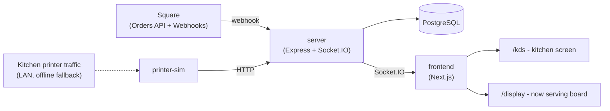

# KDS

**A self-hosted Kitchen Display System for Square.** Real-time kitchen and "now serving" screens
driven by Square Orders webhooks — with an offline fallback that keeps tickets flowing even if
Square's API goes down.

[](LICENSE)
[](https://www.typescriptlang.org/)
[](https://nextjs.org/)
[](https://nodejs.org/)
[](https://www.postgresql.org/)
[](docker-compose.yml)

## Why

Most Kitchen Display Systems either lock you into a POS vendor's own hardware/subscription, or
require you to reverse-engineer their sync yourself. This is a drop-in KDS for restaurants
already running **Square**: point it at your Square account, get a kitchen screen and a
customer-facing "now serving" board, in a couple of minutes with Docker.

## Features

- **Live kitchen screen** — active orders stream in over Square webhooks, items get checked off in real time via Socket.IO, no polling.
- **Customer-facing "now serving" board** — a second screen showing what's in progress and what just finished, safe to put on a TV in the dining room.
- **Offline resilience** — [`printer-sim`](printer-sim/) impersonates a real Star Micronics network printer on the LAN, decodes the kitchen tickets Square already prints, and forwards them to the KDS so the kitchen screen keeps working even when Square's API is unreachable.
- **Just Square's own API** — no scraping, no browser automation; orders sync via the official Orders API and signed webhooks.
- **One-command deploy** — a single `docker compose up` brings up Postgres, the API, and both screens.

## Architecture



| Component | What it does | Docs |
|---|---|---|
| [`server/`](server/) | Express + TypeScript API: syncs orders from Square (webhooks + REST), persists to Postgres, pushes updates over Socket.IO | [server/README.md](server/README.md) |
| [`frontend/`](frontend/) | Next.js app serving the kitchen screen (`/kds`) and customer display (`/display`) | [frontend/README.md](frontend/README.md) |
| [`printer-sim/`](printer-sim/) | Standalone LAN printer simulator for the offline fallback path — optional, only needed if you want offline-mode coverage | [printer-sim/README.md](printer-sim/README.md) |

## Quick start (Docker)

Requires Docker and a [Square Developer](https://developer.squareup.com/apps) app (Sandbox is
fine to start with).

```bash
git clone https://github.com/r3fract/Free-Square-KDS.git
cd Free-Square-KDS
cp .env.example .env
cp server/.env.example server/.env   # fill in your Square credentials, see below
docker compose up -d --build
```

- Kitchen screen: [http://localhost:3001/kds](http://localhost:3001/kds)
- Now-serving display: [http://localhost:3001/display](http://localhost:3001/display)
- API: [http://localhost:3000](http://localhost:3000)

Postgres's schema is applied automatically from `server/db/schema.sql` on first boot — no
separate migration step needed.

### Configuring Square

In `server/.env`, set:

| Variable | Where to find it |
|---|---|
| `SQUARE_ACCESS_TOKEN` | Square Developer Dashboard → your app → Sandbox (or Production) access token |
| `SQUARE_LOCATION_ID` | Square Developer Dashboard → Locations |
| `SQUARE_WEBHOOK_SIGNATURE_KEY` | Created when you register a webhook subscription |
| `SQUARE_WEBHOOK_NOTIFICATION_URL` | A public URL pointing at `<your-server>/webhooks/square` (e.g. an [ngrok](https://ngrok.com/) tunnel while developing) |

Then, in the Square Developer Dashboard, create a webhook subscription pointed at that URL for
`order.created`, `order.updated`, and `order.fulfillment.updated`. Full details in
[server/README.md](server/README.md).

`docker compose down -v` stops everything and drops the Postgres volume.

## Running without Docker

Each service can also be run directly with Node 20+ — see [server/README.md](server/README.md),
[frontend/README.md](frontend/README.md), and [printer-sim/README.md](printer-sim/README.md)
for per-service setup (`npm install && npm run dev` in each).

## Offline mode

Square's POS already prints kitchen tickets to a LAN printer independent of its cloud API.
[`printer-sim`](printer-sim/) impersonates that printer, decodes the ticket data Square sends
(as rasterized bitmaps, OCR'd back into structured items), and forwards it to the server — so
the kitchen screen keeps working even if Square's API is down. It's optional and off by default;
bring it up with:

```bash
cp printer-sim/.env.example printer-sim/.env
docker compose --profile printer-sim up -d --build printer-sim
```

It needs to be reachable on the real restaurant LAN to receive print traffic, which means Docker
host networking (Linux only) — see [printer-sim/README.md](printer-sim/README.md) for the full
setup, including the Tesseract OCR dependency and known protocol quirks.

## Production notes

- `server/.env` holds live Square credentials — it's gitignored and excluded from the Docker
  build context, only ever read at container runtime.
- Set `CORS_ORIGIN` (root `.env`) to your actual frontend origin(s) once you're past local
  testing — it defaults to `*`.
- `POST /api/test/orders` (a helper for exercising the sync path without a real Square order) is
  automatically disabled when `NODE_ENV=production`.

## Contributing

Issues and PRs welcome. For anything non-trivial, please open an issue first to discuss what
you'd like to change.

## License

[MIT](LICENSE)
